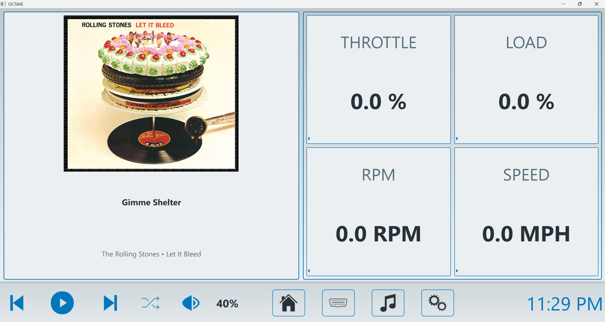
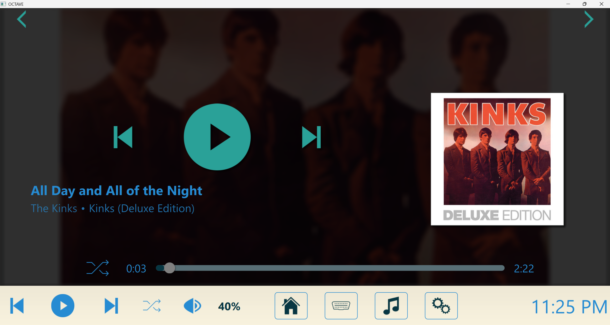
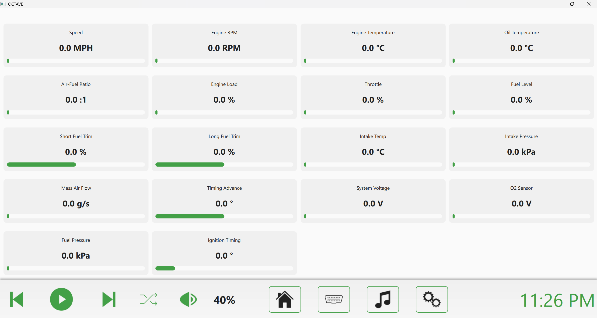

# OCTAVE

## Overview
[OCTAVE](https://octave.waybetterengineering.com/) (Open-source Cross-platform Telematics for Augmented Vehicle Experience) is a solution to having a fully programmable infotainment center in your vehicle. While OCTAVE could theoretically work in any vehicle, it best suits older cars with dilapidated infotainment systems. We were always left seeking more from the infotainment systems in our vehicles, so we wanted to develop a solution that could be extremely feature rich. We also wanted to be able to see all the OBD-II data coming from the vehicle while still being able to play music and all that good stuff.

OCTAVE is cross-platform so that the installation into a vehicle is totally up to the user. Those utlizing OCTAVE most often use a Rasberry Pi (or equivalent). All you need from there is a proportionate touchscreen, a power source, a 3D printed mount for the screen and an interface into the speakers. OCTAVE is suitable for Windows, Mac or Linux, making the code and testing of new features simple.

This app was designed to be easy to work with, so it has a Python backend with a QML based front end. There's also a settings configuration JSON file that's used to capture all user made changes, so everything you change stays changed and you can rock the app exactly as you like.

Updates for this project happen fast commits will contain the date to signify when things where last touched. Please feel free to reach out if you think this is cool or if you think its lame you can tell me all about it rob@waybetterengineering.com

## Contributors
Special thanks to Robert DeGeorge and Marquis Johnson for their significant contributions to this project.

Visit us at [WayBetterEngineering](https://www.waybetterengineering.com/) to follow our journey.

## Features
- **Media Player**: Can play MP3 files, switch between playlists, music library stats, ability to shuffle songs, metadata integration including album art
- **Spotify Integration**: Control Spotify playback on any connected device (phone, desktop, etc.)
- **OBD-II Integration**: Real-time vehicle diagnostics with customizable dashboards
- **Customizable UI**: Built-in custom themes with ability to create your own, all icons are SVG-based and easy to change to what you want, also has UI scaling for fine-tuning your needs
- **Cross-Platform**: Compatible with Windows, Linux, and macOS

## Screenshots




## System Requirements
- For now, I've successfully tested this on a Raspberry Pi 3 running Bookworm

## Installation

**Requirements:** Python 3.8+

### Windows

Open Command Prompt or PowerShell and run:
```cmd
git clone https://github.com/waybetterengineering/octave.git
cd octave
python -m venv venv
venv\Scripts\activate
pip install -r requirements.txt
python main.py
```

---

### Linux

Open a terminal and run:
```bash
git clone https://github.com/waybetterengineering/octave.git
cd octave
python -m venv venv
source venv/bin/activate
pip install -r requirements.txt
python main.py
```

**Optional:** For OBD-II Bluetooth support: `sudo usermod -a -G dialout $USER` (log out and back in after)

---

### macOS

Open Terminal and run:
```bash
git clone https://github.com/waybetterengineering/octave.git
cd octave
python -m venv venv
source venv/bin/activate
pip install -r requirements.txt
python main.py
```

---

## Troubleshooting

### NumPy/Pint Compatibility Issue
If you encounter an error like `AttributeError: module 'numpy' has no attribute 'cumproduct'`, this is due to a compatibility issue between the `pint` library (a dependency of `obd`) and newer versions of NumPy. Fix it by upgrading pint:
```bash
pip install --upgrade pint
```

---

## Spotify Setup

OCTAVE can control Spotify playback on any of your connected devices (phone, computer, etc.). Here's how to set it up:

### Step 1: Create a Spotify Developer App

1. Go to the [Spotify Developer Dashboard](https://developer.spotify.com/dashboard)
2. Log in with your Spotify account
3. Click **Create App**
4. Fill in the details:
   - **App name**: OCTAVE (or whatever you like)
   - **App description**: Car infotainment controller
   - **Redirect URI**: `http://127.0.0.1:8888/callback` *(important: enter this exactly)*
5. Check the box to agree to the terms
6. Click **Save**

### Step 2: Get Your Credentials

1. Open your newly created app in the dashboard
2. Click **Settings**
3. Copy your **Client ID** and **Client Secret**

### Step 3: Configure OCTAVE

1. Open OCTAVE and go to **Settings**
2. Scroll down to the **Spotify** section
3. Paste your **Client ID** and **Client Secret**
4. Click **Connect to Spotify**
5. A browser window will open - log in and authorize the app

### Step 4: Start Playing

1. Open Spotify on your phone or computer and start playing music
2. In OCTAVE, go to the **Media Room**
3. Click the **Local/Spotify** toggle button to switch to Spotify mode
4. Use the playback controls to control your music

**Note**: OCTAVE acts as a remote controller for Spotify. The music plays on your connected Spotify device (phone, desktop app, etc.), not through OCTAVE directly.

---

## Contributing
Contributions are welcome! Please feel free to submit a Pull Request.

1. Fork the repository  
2. Create your feature branch:  
   ```bash
   git checkout -b feature/amazing-feature
   ```
3. Commit your changes:  
   ```bash
   git commit -m "Add some amazing feature"
   ```
4. Push to the branch:  
   ```bash
   git push origin feature/amazing-feature
   ```
5. Open a Pull Request  

---


## License
Copyright © 2025 WayBetterEngineering  
This software is released under the MIT License.
