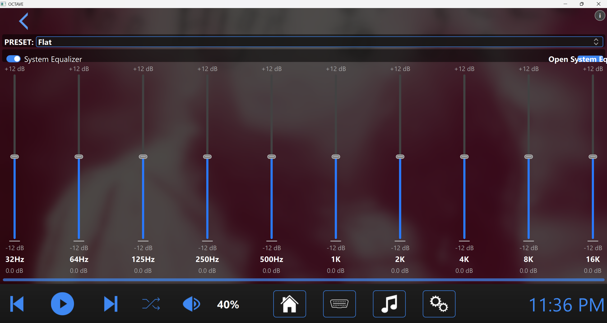

# OCTAVE

## Overview
[OCTAVE](https://octave.waybetterengineering.com/) (Open-source Cross-platform Telematics for Augmented Vehicle Experience) is a solution to having a fully programmable infotainment center in your vehicle. While OCTAVE could theoretically work in any vehicle, it best suits older cars with dilapidated infotainment systems. We were always left seeking more from the infotainment systems in our vehicles, so we wanted to develop a solution that could be extremely feature rich. We also wanted to be able to see all the OBD-II data coming from the vehicle while still being able to play music and all that good stuff.

OCTAVE is cross-platform so that the installation into a vehicle is totally up to the user. Those utlizing OCTAVE most often use a Rasberry Pi (or equivalent). All you need from there is a proportionate touchscreen, a power source, a 3D printed mount for the screen and an interface into the speakers. OCTAVE is suitable for Windows, Mac or Linux, making the code and testing of new features simple.

This app was designed to be easy to work with, so it has a Python backend with a QML based front end. There's also a settings configuration JSON file that's used to capture all user made changes, so everything you change stays changed and you can rock the app exactly as you like.

Updates for this project happen fast commits will contain the date to signify when things where last touched. Please feel free to reach out if you think this is cool or if you think its lame you can tell me all about it rob@waybetterengineering.com

## Contributors
Special thanks to Robert DeGeorge and Marquis Johnson for their significant contributions to this project.

Visit us at [WayBetterEngineering](https://www.waybetterengineering.com/) to follow our journey.

## Features
- **Media Player**: Can play MP3 files, switch between playlists, music library stats, ability to shuffle songs, metadata integration including album art
- **Equalizer**: 10-band system-level equalizer (requires APO for Windows, EasyEffects for Linux, and EQ for Mac)
- **OBD-II Integration**: Real-time vehicle diagnostics with customizable dashboards
- **Customizable UI**: Built-in custom themes with ability to create your own, all icons are SVG-based and easy to change to what you want, also has UI scaling for fine-tuning your needs
- **Cross-Platform**: Compatible with Windows, Linux, and macOS

## Screenshots





## System Requirements
- For now, I've successfully tested this on a Raspberry Pi 3 running Bookworm

## Installation

### Prerequisites
- Python 3.8 or newer
- All required packages listed in the [requirements.txt](requirements.txt) file

---

### Windows Installation

1. Open Command Prompt as administrator or PowerShell with elevated privileges:
   ```powershell
   Set-ExecutionPolicy -ExecutionPolicy RemoteSigned -Scope CurrentUser
   ```

2. Navigate to your desired installation location:
   ```cmd
   cd C:\Users\YourUserName\Documents
   ```

3. Clone the repository and enter the directory:
   ```cmd
   git clone https://github.com/waybetterengineering/octave.git
   cd octave
   ```

4. Create and activate a virtual environment:
   ```cmd
   python -m venv venv
   venv\Scripts\activate
   ```

5. Install dependencies:
   ```cmd
   pip install -r requirements.txt
   pip install --upgrade numpy pint
   ```

6. For equalizer support, install Equalizer APO for system-wide equalizer support.

7. Launch the application:
   ```cmd
   python main.py
   ```

---

### Linux Installation

1. Open a terminal window.

2. Navigate to your desired installation location:
   ```bash
   cd ~/Documents
   ```

3. Clone the repository and enter the directory:
   ```bash
   git clone https://github.com/waybetterengineering/octave.git
   cd octave
   ```

4. Create and activate a virtual environment:
   ```bash
   python -m venv venv
   source venv/bin/activate
   ```

5. Install dependencies:
   ```bash
   pip install -r requirements.txt
   pip install --upgrade numpy pint
   ```

6. For OBD support, ensure you have permissions to access the Bluetooth device:
   ```bash
   sudo usermod -a -G dialout $USER
   ```
   (You may need to log out and back in for this to take effect.)

7. For equalizer functionality, install EasyEffects:
   ```bash
   flatpak install flathub com.github.wwmm.easyeffects
   ```

8. Launch the application:
   ```bash
   python main.py
   ```

---

### macOS Installation

1. Open Terminal.

2. Navigate to your desired installation location:
   ```bash
   cd ~/Documents
   ```

3. Clone the repository and enter the directory:
   ```bash
   git clone https://github.com/waybetterengineering/octave.git
   cd octave
   ```

4. Create and activate a virtual environment:
   ```bash
   python -m venv venv
   source venv/bin/activate
   ```

5. Install dependencies:
   ```bash
   pip install -r requirements.txt
   pip install --upgrade numpy pint
   ```

6. For equalizer support, consider installing eqMac.

7. Launch the application:
   ```bash
   python main.py
   ```

---

## Contributing
Contributions are welcome! Please feel free to submit a Pull Request.

1. Fork the repository  
2. Create your feature branch:  
   ```bash
   git checkout -b feature/amazing-feature
   ```
3. Commit your changes:  
   ```bash
   git commit -m "Add some amazing feature"
   ```
4. Push to the branch:  
   ```bash
   git push origin feature/amazing-feature
   ```
5. Open a Pull Request  

---


## License
Copyright © 2025 WayBetterEngineering  
This software is released under the MIT License.
